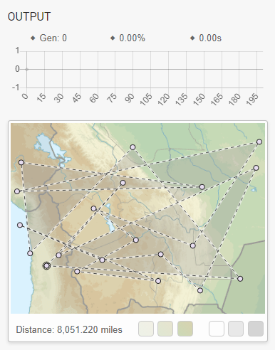
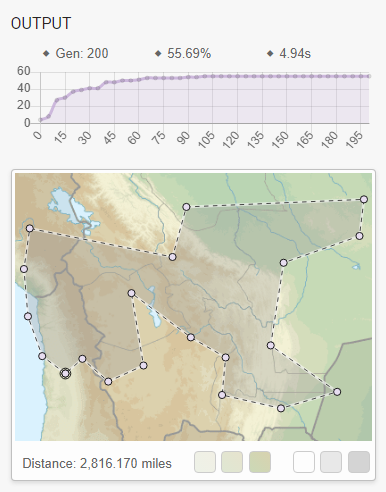
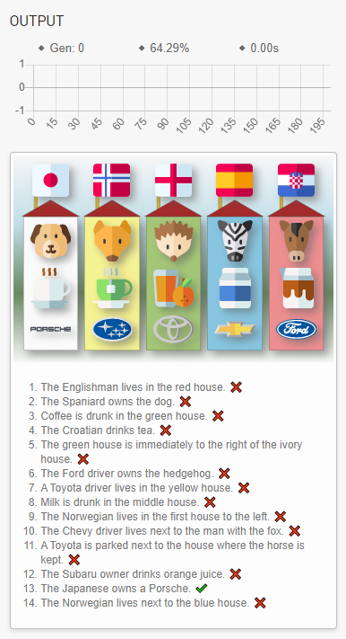
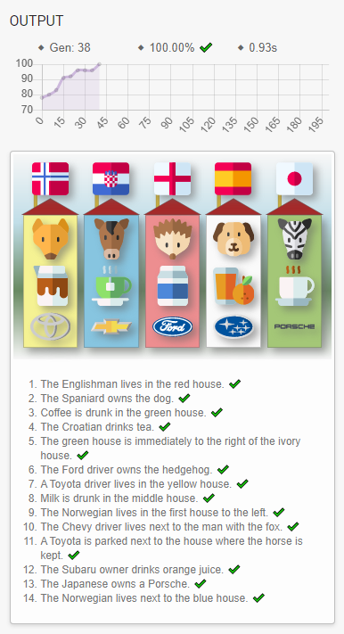
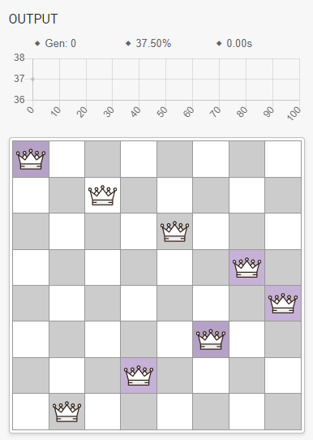
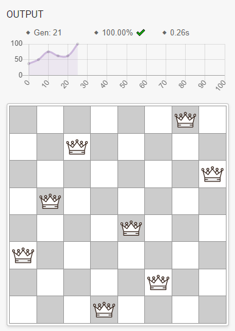
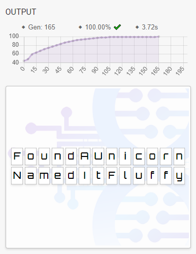

## Overview

BlazorAI is a web app developed in [Blazor](https://dotnet.microsoft.com/apps/aspnet/web-apps/blazor) to explore the use of [Genetic Algorithms](https://en.wikipedia.org/wiki/Genetic_algorithm) for solving problems.

The live version of the site can be viewed at [www.blazor.ai](https://www.blazor.ai/).

The Genetic Algorithm library used for evolving solutions is [GeneticSharp](https://github.com/giacomelli/GeneticSharp) by [Diego Giacomelli](https://github.com/giacomelli).

The Blazor component library used is [Blazorise](https://blazorise.com/) by [Mladen Macanovic](https://github.com/stsrki).

This project was inspired by [Tensorflow Playground](https://playground.tensorflow.org/).

## Problems

These are the problems that have been implemented so far:

### Travelling Salesman

> Given a list of cities and the distances between each pair of cities, what is the shortest possible route that visits each city exactly once and returns to the origin city?

* [Description](https://en.wikipedia.org/wiki/Travelling_salesman_problem)
* [Demo](https://www.blazor.ai/travellingsalesman)
* [Solver code](BlazorAI.Shared/Solvers/TravellingSalesmanSolver.cs)

 

 

### Five Houses / Einstein's Riddle / Zebra Puzzle

> Who owns the zebra?

* [Description](https://en.wikipedia.org/wiki/Zebra_Puzzle)
* [Demo](https://www.blazor.ai/fivehouses)
* [Solver code](BlazorAI.Shared/Solvers/FiveHousesSolver.cs)
  
 

### Eight Queens problem

> How can we arrange Eight Queens on an 8 x 8 chessboard such that none of them share the same row, column or diagonal?

* [Description](https://en.wikipedia.org/wiki/Eight_queens_puzzle)
* [Demo](https://www.blazor.ai/eightqueens)
* [Solver code](BlazorAI.Shared/Solvers/EightQueensSolver.cs)

 

### Password problem

> How can we crack a password when given feedback on the closeness of our guess?

* [Demo](https://www.blazor.ai/password)
* [Solver code](BlazorAI.Shared/Solvers/PasswordSolver.cs)

 

